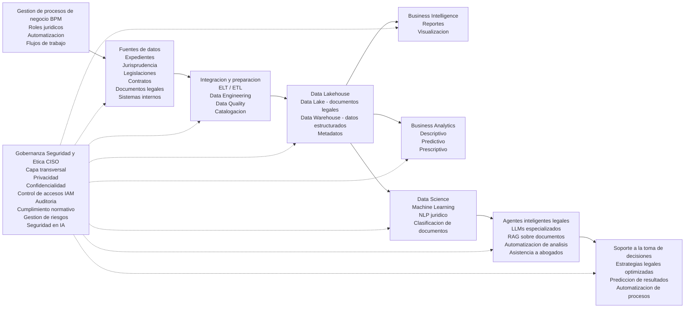

# Caso 2
## Nombre de la empresa: Frodalex Systems

Frodalex Systems es una firma legal ficticia especializada en servicios jurídicos corporativos, litigio estratégico y asesoría regulatoria, que decide implementar una estrategia integral de gestión y explotación avanzada de datos con el objetivo de optimizar la gestión de casos, mejorar la toma de decisiones legales y fortalecer su ventaja competitiva en un entorno altamente regulado.

## Enfoque organizacional
La propuesta de sistema para el despacho es implementar una estrategia integral de gestión y explotación avanzada de datos legales, con el objetivo de optimizar los procesos y la gestión interna, mejorar la toma de decisiones estratégicas y aumentar la eficiencia operativa.
- Administración de expedientes
- Seguimiento de casos
- Gestión de audiencias
- Control documental legal

## Fuentes de datos 
Para el desarrollo de la herramienta, se deben de proporcionar fuentes de datos como lo son:
- Sistemas internos de gestión
- Jurisprudencias y legislaciones
- Documentos legales como contratos, demandas y sentencias
- Normativas y boletines oficiales
- APIs de sistemas judiciales

Dado a que estos contienen información delicada, es necesario llevar un control y resguardo con respecto a todos los documentos, así como una firma de responsabilidad de todos los involucrados en el desarrollo así como monitoreo del uso de estos.

Estos datos son ingeridos y almacenados en una arquitectura Data Lakehouse, que permite combinar información estructurada y no estructurada, facilitando tanto el análisis jurídico como el entrenamiento de modelos de inteligencia artificial.

Sobre esta plataforma, se despliega un ecosistema de Business Intelligence (BI) orientado a la generación de insights estratégicos, tales como:
- Tiempos de resolución de casos  
- Carga de trabajo por abogado  
- Probabilidad de éxito en litigios  
- Cumplimiento de plazos procesales  

De manera complementaria, el área de Business Analytics implementa modelos analíticos para:
- Identificar patrones en resoluciones judiciales  
- Predecir resultados de litigios  
- Optimizar estrategias legales y asignación de recursos  

En un nivel más avanzado, el equipo de Data Science desarrolla modelos basados en Machine Learning, Deep Learning y Procesamiento de Lenguaje Natural (PLN), orientados al análisis de textos legales, clasificación de documentos, extracción de cláusulas y análisis de jurisprudencia.

A continuación, se presenta la arquitectura propuesta:

## Seguridad de la Información y Rol del CISO 

Finalmente, para garantizar la protección de la información y la confiabilidad de los sistemas implementados, se incorpora el rol del Chief Information Security Officer (CISO), quien lidera la estrategia de seguridad dentro de la organización.

Si bien la empresa contempla diversos roles estratégicos como el CEO y líderes de Data Science, esta sección se centra en el CISO debido a la criticidad de la seguridad en entornos donde se gestionan datos altamente sensibles.

En este contexto, la seguridad de la información se convierte en un pilar fundamental, ya que la exposición o filtración de datos puede derivar en consecuencias legales, reputacionales y financieras significativas.

### Protección de la información y control de accesos

El CISO implementa:

- Cifrado de datos en reposo y en tránsito
- Control de acceso basado en roles (RBAC)
- Gestión de identidades (IAM)
- Autenticación multifactor (MFA)

### Cumplimiento normativo

Se asegura:

- Protección de datos personales
- Cumplimiento legal
- Auditorías
- Trazabilidad de la información
- Seguridad en datos e IA

### Incluye:

- Protección de pipelines de datos
- Seguridad en modelos de IA
- Prevención de fugas en LLMs
- Control de agentes inteligentes
- Gestión de riesgos

### Se encarga de:

- Evaluación de vulnerabilidades
- Planes de respuesta a incidentes
- Mitigación de riesgos
- Gobernanza y ética
- Supervisa:
- Uso responsable de datos
- Mitigación de sesgos
- Transparencia en modelos
- Continuidad del negocio

### Implementa:

- Planes de recuperación (DRP)
- Respaldo de información
- Infraestructura resiliente

En conjunto, estas acciones consolidan la seguridad de la información como un componente estratégico dentro de la transformación digital de la organización.

## Rol del Científico de Datos en Frodalex Systems

Dentro de la arquitectura propuesta, el Científico de Datos desempeña un papel estratégico en la capa de **Data Science**, conectando los datos del Data Lakehouse con soluciones inteligentes que impactan directamente en la toma de decisiones legales.

Su función no se limita al desarrollo de modelos, sino que abarca todo el ciclo de vida analítico, desde la comprensión del problema jurídico hasta la implementación de soluciones basadas en inteligencia artificial.

---

## Objetivos del Científico de Datos

- Transformar datos legales en conocimiento accionable
- Mejorar la probabilidad de éxito en litigios
- Optimizar la asignación de recursos legales
- Automatizar el análisis documental
- Reducir tiempos operativos en procesos jurídicos

---

## Proceso de Trabajo del Científico de Datos

### 1. Entendimiento del Problema Legal

El Científico de Datos colabora directamente con abogados y áreas de negocio para traducir problemas jurídicos en problemas analíticos.

**Ejemplos:**
- ¿Qué variables influyen en ganar un caso?
- ¿Cuánto tiempo tomará resolver un litigio?
- ¿Qué estrategia legal tiene mayor probabilidad de éxito?

---

### 2. Exploración y Análisis de Datos (EDA)

Trabaja sobre datos provenientes del Data Lakehouse:

- Expedientes históricos
- Jurisprudencia
- Documentos legales
- Datos operativos del despacho

**Actividades:**
- Identificación de patrones en resoluciones judiciales
- Análisis de correlaciones entre variables legales
- Detección de anomalías en procesos

---

### 3. Preparación y Feature Engineering

Transforma datos complejos en variables útiles para modelos:

- Extracción de información de textos legales (NLP)
- Generación de variables como:
  - Tipo de caso
  - Complejidad legal
  - Tiempo promedio de resolución
  - Historial del juez o tribunal

**Ejemplo:**
Convertir contratos en variables como:
- Riesgo legal
- Tipo de cláusula
- Penalizaciones asociadas

---

### 4. Desarrollo de Modelos Predictivos

Se implementan modelos de Machine Learning para:

#### Predicción de litigios
- Probabilidad de ganar o perder un caso

#### Estimación de tiempos
- Duración esperada de procesos judiciales

#### Optimización de recursos
- Asignación eficiente de abogados según carga y experiencia

#### Análisis de riesgo
- Identificación de casos con alta incertidumbre

---

### 5. Modelos de NLP Jurídico

Dado el alto volumen de texto legal, se desarrollan soluciones de Procesamiento de Lenguaje Natural:

- Clasificación automática de documentos legales
- Extracción de cláusulas relevantes
- Análisis de jurisprudencia
- Resumen automático de documentos

**Ejemplo:**
Un modelo que detecta cláusulas de riesgo en contratos en segundos.

---

### 6. Integración con Agentes Inteligentes (LLMs + RAG)

El Científico de Datos colabora en la implementación de:

- Modelos de lenguaje especializados en derecho
- Sistemas RAG (Retrieval-Augmented Generation) sobre documentos legales
- Asistentes inteligentes para abogados

**Capacidades:**
- Responder consultas legales basadas en documentos internos
- Generar estrategias jurídicas sugeridas
- Automatizar análisis de casos

---

### 7. Evaluación y Validación de Modelos

Se asegura que los modelos sean:

- Precisos (accuracy, recall, F1-score)
- Interpretables (explicabilidad en decisiones legales)
- Libres de sesgos

**Importante en contexto legal:**
La explicabilidad es crítica para justificar decisiones ante clientes o tribunales.

---

### 8. Despliegue y MLOps

Trabaja junto con el equipo de MLOps para:

- Implementar modelos en producción
- Automatizar pipelines de entrenamiento
- Monitorear desempeño en tiempo real
- Actualizar modelos con nuevos datos

---

### 9. Visualización y Comunicación

Los resultados se integran en sistemas de BI:

- Dashboards de probabilidad de éxito
- Indicadores de rendimiento legal
- Alertas de riesgo en casos

**Ejemplo:**
Un panel que muestra:
- Casos críticos
- Probabilidad de fallo adverso
- Recomendaciones estratégicas

---

## Integración con la Arquitectura

El Científico de Datos interactúa directamente con:

- **Data Lakehouse** → Fuente principal de datos
- **Business Analytics** → Modelos descriptivos y predictivos base
- **Agentes Inteligentes (LLMs)** → Aplicación avanzada de IA
- **BI** → Visualización de resultados
- **Gobernanza y CISO** → Cumplimiento y seguridad

---
A partir de las funciones descritas, el rol del Científico de Datos en Frodalex
Systems puede profundizarse mediante la formalización matemática de los problemas
legales, lo que permite no solo analizar información, sino optimizar la toma de
decisiones bajo incertidumbre. Este enfoque transforma la práctica jurídica
tradicional en un proceso basado en modelos cuantificables y evidencia estadística.

---
### Modelado de probabilidad de éxito en litigios
Uno de los principales problemas del despacho consiste en estimar la probabilidad de éxito de un caso legar

## Consideraciones de Seguridad y Ética

En coordinación con el CISO, el Científico de Datos garantiza:

- Uso responsable de datos sensibles
- Cumplimiento de normativas legales
- Prevención de sesgos en modelos
- Protección contra fugas de información en IA
- Transparencia en decisiones automatizadas

---

## Resultado Esperado

La implementación del rol del Científico de Datos permite a Frodalex Systems:

- Anticipar resultados legales
- Reducir incertidumbre en litigios
- Aumentar la eficiencia operativa
- Automatizar tareas repetitivas
- Fortalecer su ventaja competitiva mediante el uso de IA

---

## Ejemplo de Flujo Completo

1. Se ingresa un nuevo caso al sistema  
2. El modelo analiza casos similares en el Data Lakehouse  
3. Se calcula la probabilidad de éxito  
4. Se estiman tiempos y costos  
5. El sistema sugiere estrategia legal  
6. El abogado toma decisiones informadas  

---

## Conclusión

El Científico de Datos en Frodalex Systems actúa como un puente entre el conocimiento jurídico y la inteligencia artificial, permitiendo transformar datos complejos en decisiones estratégicas, automatizadas y basadas en evidencia.

## Referencias

> Provost, F., & Fawcett, T. (2013). Data Science for Business. O’Reilly.

> Inmon, W. (2016). Building the Data Warehouse. Wiley.

> Huyen, C. (2022). Designing Machine Learning Systems. O’Reilly.

> Burkov, A. (2019). The Hundred-Page Machine Learning Book.

> Russell, S., & Norvig, P. (2021). Artificial Intelligence: A Modern Approach. Pearson.

> Goodfellow, I., Bengio, Y., & Courville, A. (2016). Deep Learning. MIT Press.

> Ashley, K. D. (2017). Artificial Intelligence and Legal Analytics. Cambridge University Press.

> Susskind, R. (2019). Online Courts and the Future of Justice. Oxford University Press.
