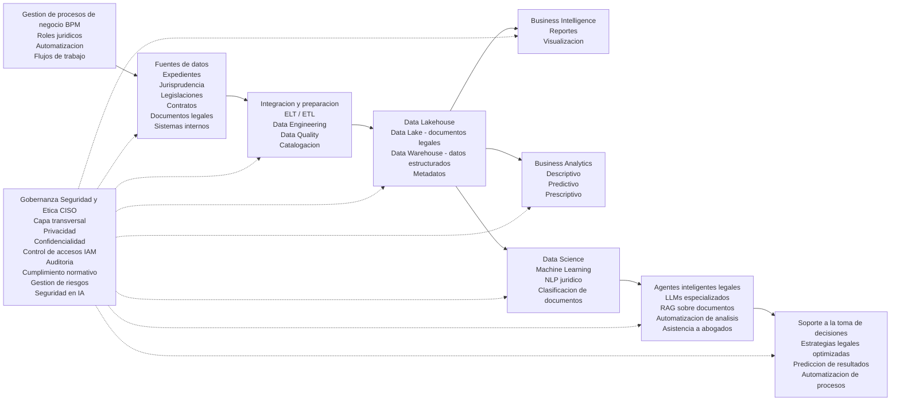

# Caso 2
## Nombre de la empresa: Frodalex Systems

Frodalex Systems es una firma legal ficticia especializada en servicios jurídicos corporativos, litigio estratégico y asesoría regulatoria, que decide implementar una estrategia integral de gestión y explotación avanzada de datos con el objetivo de optimizar la gestión de casos, mejorar la toma de decisiones legales y fortalecer su ventaja competitiva en un entorno altamente regulado.

## Enfoque organizacional
La propuesta de sistema para el despacho es implementar una estrategia integral de gestión y explotación avanzada de datos legales, con el objetivo de optimizar los procesos y la gestión interna, mejorar la toma de decisiones estratégicas y aumentar la eficiencia operativa.
- Administración de expedientes
- Seguimiento de casos
- Gestión de audiencias
- Control documental legal

## Fuentes de datos 
Para el desarrollo de la herramienta, se deben de proporcionar fuentes de datos como lo son:
- Sistemas internos de gestión
- Jurisprudencias y legislaciones
- Documentos legales como contratos, demandas y sentencias
- Normativas y boletines oficiales
- APIs de sistemas judiciales

Dado a que estos contienen información delicada, es necesario llevar un control y resguardo con respecto a todos los documentos, así como una firma de responsabilidad de todos los involucrados en el desarrollo así como monitoreo del uso de estos.

Estos datos son ingeridos y almacenados en una arquitectura Data Lakehouse, que permite combinar información estructurada y no estructurada, facilitando tanto el análisis jurídico como el entrenamiento de modelos de inteligencia artificial.

Sobre esta plataforma, se despliega un ecosistema de Business Intelligence (BI) orientado a la generación de insights estratégicos, tales como:
- Tiempos de resolución de casos  
- Carga de trabajo por abogado  
- Probabilidad de éxito en litigios  
- Cumplimiento de plazos procesales  

De manera complementaria, el área de Business Analytics implementa modelos analíticos para:
- Identificar patrones en resoluciones judiciales  
- Predecir resultados de litigios  
- Optimizar estrategias legales y asignación de recursos  

En un nivel más avanzado, el equipo de Data Science desarrolla modelos basados en Machine Learning, Deep Learning y Procesamiento de Lenguaje Natural (PLN), orientados al análisis de textos legales, clasificación de documentos, extracción de cláusulas y análisis de jurisprudencia.

A continuación, se presenta la arquitectura propuesta:

## Seguridad de la Información y Rol del CISO 

Finalmente, para garantizar la protección de la información y la confiabilidad de los sistemas implementados, se incorpora el rol del Chief Information Security Officer (CISO), quien lidera la estrategia de seguridad dentro de la organización.

Si bien la empresa contempla diversos roles estratégicos como el CEO y líderes de Data Science, esta sección se centra en el CISO debido a la criticidad de la seguridad en entornos donde se gestionan datos altamente sensibles.

En este contexto, la seguridad de la información se convierte en un pilar fundamental, ya que la exposición o filtración de datos puede derivar en consecuencias legales, reputacionales y financieras significativas.

### Protección de la información y control de accesos

El CISO implementa:

- Cifrado de datos en reposo y en tránsito
- Control de acceso basado en roles (RBAC)
- Gestión de identidades (IAM)
- Autenticación multifactor (MFA)

### Cumplimiento normativo

Se asegura:

- Protección de datos personales
- Cumplimiento legal
- Auditorías
- Trazabilidad de la información
- Seguridad en datos e IA

### Incluye:

- Protección de pipelines de datos
- Seguridad en modelos de IA
- Prevención de fugas en LLMs
- Control de agentes inteligentes
- Gestión de riesgos

### Se encarga de:

- Evaluación de vulnerabilidades
- Planes de respuesta a incidentes
- Mitigación de riesgos
- Gobernanza y ética
- Supervisa:
- Uso responsable de datos
- Mitigación de sesgos
- Transparencia en modelos
- Continuidad del negocio

### Implementa:

- Planes de recuperación (DRP)
- Respaldo de información
- Infraestructura resiliente

En conjunto, estas acciones consolidan la seguridad de la información como un componente estratégico dentro de la transformación digital de la organización.

## Rol del Científico de Datos en Frodalex Systems

Dentro de la arquitectura propuesta, el Científico de Datos desempeña un papel estratégico en la capa de **Data Science**, conectando los datos del Data Lakehouse con soluciones inteligentes que impactan directamente en la toma de decisiones legales.

Su función no se limita al desarrollo de modelos, sino que abarca todo el ciclo de vida analítico, desde la comprensión del problema jurídico hasta la implementación de soluciones basadas en inteligencia artificial.

---

## Objetivos del Científico de Datos

- Transformar datos legales en conocimiento accionable
- Mejorar la probabilidad de éxito en litigios
- Optimizar la asignación de recursos legales
- Automatizar el análisis documental
- Reducir tiempos operativos en procesos jurídicos

---

## Proceso de Trabajo del Científico de Datos

### 1. Entendimiento del Problema Legal

El Científico de Datos colabora directamente con abogados y áreas de negocio para traducir problemas jurídicos en problemas analíticos.

**Ejemplos:**
- ¿Qué variables influyen en ganar un caso?
- ¿Cuánto tiempo tomará resolver un litigio?
- ¿Qué estrategia legal tiene mayor probabilidad de éxito?

---

### 2. Exploración y Análisis de Datos (EDA)

Trabaja sobre datos provenientes del Data Lakehouse:

- Expedientes históricos
- Jurisprudencia
- Documentos legales
- Datos operativos del despacho

**Actividades:**
- Identificación de patrones en resoluciones judiciales
- Análisis de correlaciones entre variables legales
- Detección de anomalías en procesos

---

### 3. Preparación y Feature Engineering

Transforma datos complejos en variables útiles para modelos:

- Extracción de información de textos legales (NLP)
- Generación de variables como:
  - Tipo de caso
  - Complejidad legal
  - Tiempo promedio de resolución
  - Historial del juez o tribunal

**Ejemplo:**
Convertir contratos en variables como:
- Riesgo legal
- Tipo de cláusula
- Penalizaciones asociadas

---

### 4. Desarrollo de Modelos Predictivos

Se implementan modelos de Machine Learning para:

#### Predicción de litigios
- Probabilidad de ganar o perder un caso

#### Estimación de tiempos
- Duración esperada de procesos judiciales

#### Optimización de recursos
- Asignación eficiente de abogados según carga y experiencia

#### Análisis de riesgo
- Identificación de casos con alta incertidumbre

---

### 5. Modelos de NLP Jurídico

Dado el alto volumen de texto legal, se desarrollan soluciones de Procesamiento de Lenguaje Natural:

- Clasificación automática de documentos legales
- Extracción de cláusulas relevantes
- Análisis de jurisprudencia
- Resumen automático de documentos

**Ejemplo:**
Un modelo que detecta cláusulas de riesgo en contratos en segundos.

---

### 6. Integración con Agentes Inteligentes (LLMs + RAG)

El Científico de Datos colabora en la implementación de:

- Modelos de lenguaje especializados en derecho
- Sistemas RAG (Retrieval-Augmented Generation) sobre documentos legales
- Asistentes inteligentes para abogados

**Capacidades:**
- Responder consultas legales basadas en documentos internos
- Generar estrategias jurídicas sugeridas
- Automatizar análisis de casos

---

### 7. Evaluación y Validación de Modelos

Se asegura que los modelos sean:

- Precisos (accuracy, recall, F1-score)
- Interpretables (explicabilidad en decisiones legales)
- Libres de sesgos

**Importante en contexto legal:**
La explicabilidad es crítica para justificar decisiones ante clientes o tribunales.

---

### 8. Despliegue y MLOps

Trabaja junto con el equipo de MLOps para:

- Implementar modelos en producción
- Automatizar pipelines de entrenamiento
- Monitorear desempeño en tiempo real
- Actualizar modelos con nuevos datos

---

### 9. Visualización y Comunicación

Los resultados se integran en sistemas de BI:

- Dashboards de probabilidad de éxito
- Indicadores de rendimiento legal
- Alertas de riesgo en casos

**Ejemplo:**
Un panel que muestra:
- Casos críticos
- Probabilidad de fallo adverso
- Recomendaciones estratégicas

---

## Integración con la Arquitectura

El Científico de Datos interactúa directamente con:

- **Data Lakehouse** → Fuente principal de datos
- **Business Analytics** → Modelos descriptivos y predictivos base
- **Agentes Inteligentes (LLMs)** → Aplicación avanzada de IA
- **BI** → Visualización de resultados
- **Gobernanza y CISO** → Cumplimiento y seguridad

---
A partir de las funciones descritas, el rol del Científico de Datos puede profundizarse mediante la formalización matemática de los problemas
legales, lo que permite no solo analizar información, sino optimizar la toma de
decisiones bajo incertidumbre. Este enfoque transforma la práctica jurídica
tradicional en un proceso basado en modelos cuantificables y evidencia estadística.

### Modelado de probabilidad de éxito en litigios
Uno de los principales problemas del despacho consiste en estimar la probabilidad de éxito de un caso legal. Este problema puede abordarse mediante modelos de clasificación, como la regresión logística:

$$
P(Y=1 \mid X) = \frac{1}{1 + e^{-\beta_0 - \beta_1 x_1 - \beta_2 x_2 - \cdots - \beta_n x_n}}
$$

Donde:

- $Y$: resultado del caso (ganado o perdido)  
- $X$: conjunto de variables explicativas  
- $x_1, x_2, ..., x_n$: características como tipo de caso, evidencia, juez, duración, etc.  
- $\beta$: coeficientes del modelo

Este modelo permite:

- Priorizar litigios estratégicos  
- Evaluar riesgos legales  
- Seleccionar estrategias jurídicas más efectivas  

### Optimización en la asignación de recursos legales

Otro problema clave es la asignación eficiente de abogados a los casos disponibles. Este puede formularse como un problema de optimización:

$$
\max \sum_{i=1}^{n} \sum_{j=1}^{m} p_{ij} x_{ij}
$$

Donde:

- $x_{ij} \in \{0,1\}$: indica si el abogado $j$ es asignado al caso $i$  
- $p_{ij}$: probabilidad de éxito si el abogado $j$ toma el caso $i$  

Este enfoque permite:

- Maximizar la probabilidad global de éxito del despacho  
- Distribuir la carga de trabajo de manera equilibrada  
- Asignar casos según experiencia y especialización  

### Análisis de texto jurídico mediante NLP

Dado que gran parte de la información legal se encuentra en formato textual, el Científico de Datos emplea técnicas de Procesamiento de Lenguaje Natural (NLP) para transformar documentos en datos estructurados.

Aplicaciones principales:

- Clasificación automática de documentos legales  
- Extracción de cláusulas relevantes  
- Identificación de riesgos en contratos  
- Medición de similitud entre casos  

### Simulación de escenarios y análisis de incertidumbre

Para complementar el análisis predictivo, se pueden implementar técnicas de simulación, como métodos tipo Monte Carlo, que permiten:

- Generar múltiples escenarios posibles de resolución de casos  
- Estimar la variabilidad en tiempos, costos y resultados  
- Evaluar riesgos bajo distintos supuestos  

### Aporte estratégico del enfoque cuantitativo

La incorporación de estos métodos permite que el buffet evolucione de un modelo basado principalmente en la experiencia profesional a uno sustentado en análisis cuantitativo y optimización.

Desde el rol del Científico de Datos, esto implica no solo desarrollar modelos, sino traducir problemas legales complejos en estructuras matemáticas que permitan mejorar la precisión, eficiencia y transparencia en la toma de decisiones.

---

## Consideraciones de Seguridad y Ética

En coordinación con el CISO, el Científico de Datos garantiza:

- Uso responsable de datos sensibles
- Cumplimiento de normativas legales
- Prevención de sesgos en modelos
- Protección contra fugas de información en IA
- Transparencia en decisiones automatizadas

---

## Resultado Esperado

La implementación del rol del Científico de Datos permite a Frodalex Systems:

- Anticipar resultados legales
- Reducir incertidumbre en litigios
- Aumentar la eficiencia operativa
- Automatizar tareas repetitivas
- Fortalecer su ventaja competitiva mediante el uso de IA

---

## Ejemplo de Flujo Completo

1. Se ingresa un nuevo caso al sistema  
2. El modelo analiza casos similares en el Data Lakehouse  
3. Se calcula la probabilidad de éxito  
4. Se estiman tiempos y costos  
5. El sistema sugiere estrategia legal  
6. El abogado toma decisiones informadas  

---

## Conclusión

El Científico de Datos en Frodalex Systems actúa como un puente entre el conocimiento jurídico y la inteligencia artificial, permitiendo transformar datos complejos en decisiones estratégicas, automatizadas y basadas en evidencia.

---

## Rol del Ingeniero de Datos en Frodalex Systems

Dentro de la arquitectura propuesta, el Ingeniero de Datos desempeña un papel fundamental en la capa de ingesta, almacenamiento, procesamiento y gobernanza de la información, actuando como el habilitador técnico que garantiza que los datos fluyan de manera confiable, segura y escalable desde las fuentes originales hasta los consumidores finales: Business Intelligence, Business Analytics, Data Science y los sistemas de inteligencia artificial.

Su función no se limita a la operación técnica de pipelines, sino que abarca el diseño y mantenimiento de la infraestructura de datos que sustenta la toma de decisiones estratégicas en el despacho.

### Objetivos del Ingeniero de Datos

- Diseñar e implementar la arquitectura de datos (Data Lakehouse) que integre fuentes estructuradas y no estructuradas.
- Automatizar la ingesta, transformación y entrega de datos con altos estándares de calidad y confiabilidad.
- Garantizar la seguridad, gobernanza y trazabilidad de la información en coordinación con el CISO.
- Habilitar pipelines de datos eficientes para el entrenamiento y operación de modelos de Machine Learning y NLP.
- Asegurar la escalabilidad, resiliencia y continuidad operativa de la plataforma de datos.

### Proceso de Trabajo del Ingeniero de Datos

#### 1. Diseño de Arquitectura de Datos

El Ingeniero de Datos define e implementa la arquitectura **Data Lakehouse**, que permite combinar información estructurada (como tablas de gestión de casos) y no estructurada (como documentos legales, sentencias y contratos) en una única plataforma unificada. Esta arquitectura organiza los datos en capas:

| Capa | Descripción |
|------|-------------|
| Bronce | Ingesta de datos crudos desde sistemas internos, APIs judiciales y repositorios documentales. |
| Plata | Limpieza, normalización y aplicación de reglas de calidad. |
| Oro | Agregación y modelado de datos optimizados para consumo analítico y de inteligencia artificial. |

#### 2. Ingesta de Datos desde Fuentes Heterogéneas

Se desarrollan pipelines automatizados para la ingesta continua desde:
- Sistemas internos de gestión de expedientes y seguimiento de casos.
- APIs de sistemas judiciales para la obtención de estados procesales.
- Documentos legales no estructurados (contratos, demandas, sentencias) en formatos como PDF, Word y texto plano.
- Jurisprudencias, legislaciones y boletines oficiales.

#### 3. Transformación y Calidad de Datos

El Ingeniero de Datos implementa procesos de transformación (ETL/ELT) que permiten:
- Estandarizar formatos de fechas, identificadores de casos y metadatos legales.
- Conciliar información proveniente de múltiples fuentes.
- Aplicar reglas de calidad para detectar duplicados, valores atípicos y anomalías.
- Preparar datasets listos para análisis y modelado.

#### 4. Seguridad y Gobernanza de la Información

En estrecha coordinación con el **CISO**, el Ingeniero de Datos implementa los controles técnicos que garantizan:
- Cifrado de datos en reposo y en tránsito.
- Control de acceso basado en roles (RBAC) sobre tablas, columnas y documentos sensibles.
- Trazabilidad completa del origen, transformación y consumo de los datos.
- Anonimización y seudonimización de información personal cuando sea requerido por normativas.

Además, se encarga de la gestión del ciclo de vida del dato, definiendo políticas de retención, archivado y purgado conforme a los requisitos legales aplicables.

#### 5. Habilitación de Pipelines para Data Science y NLP

Para soportar el desarrollo de modelos predictivos y soluciones de Procesamiento de Lenguaje Natural (PLN), el Ingeniero de Datos construye pipelines que permiten:
- Extraer y estructurar contenido de documentos legales mediante técnicas de NLP aplicadas en la capa de procesamiento.
- Generar *embeddings* vectoriales a partir de textos jurídicos para alimentar sistemas RAG (Retrieval-Augmented Generation).
- Mantener datasets versionados y actualizados para entrenamiento y reentrenamiento de modelos de Machine Learning.

#### 6. Integración con Agentes Inteligentes (LLMs + RAG)

El Ingeniero de Datos colabora en la implementación de sistemas de inteligencia artificial generativa mediante:
- La construcción de bases de conocimiento vectoriales que permitan consultas semánticas sobre expedientes y jurisprudencias.
- La integración de modelos de lenguaje (LLMs) con los repositorios documentales del despacho.
- El aseguramiento de baja latencia en las consultas realizadas por asistentes inteligentes para abogados.

#### 7. Automatización y MLOps

Para garantizar la confiabilidad y repetibilidad de los procesos analíticos, el Ingeniero de Datos implementa prácticas de **MLOps** que incluyen:
- Automatización de pipelines de entrenamiento y despliegue de modelos.
- Monitoreo continuo de la calidad de los datos en entornos productivos.
- Versionamiento de datos y modelos para asegurar reproducibilidad.
- Integración con flujos de CI/CD para despliegues seguros y controlados.

#### 8. Visualización y Consumo Analítico

Los datos procesados son puestos a disposición de los equipos de Business Intelligence y Business Analytics mediante:
- Modelos de datos optimizados para dashboards de alto desempeño.
- Vistas agregadas que permiten consultas eficientes sobre indicadores clave: tiempos de resolución, carga de trabajo, probabilidad de éxito y cumplimiento de plazos.
- Catálogo de datos que facilita el descubrimiento y uso de activos de información por parte de analistas y científicos de datos.

#### 9. Resiliencia y Continuidad del Negocio

El Ingeniero de Datos diseña la infraestructura con criterios de alta disponibilidad y recuperación ante desastres:
- Implementación de estrategias de respaldo y recuperación (DRP).
- Configuración de infraestructura resiliente en entornos de nube o híbridos.
- Escalabilidad horizontal para manejar volúmenes crecientes de datos y consultas.

### Integración con la Arquitectura

El Ingeniero de Datos interactúa directamente con:

| Componente | Rol en la interacción |
|------------|----------------------|
| Fuentes de datos | Sistemas internos, APIs judiciales, repositorios documentales. |
| Data Lakehouse | Responsable de su implementación, operación y evolución. |
| CISO | Para garantizar seguridad, cumplimiento y gobernanza. |
| Data Science y Analytics | Proveyendo datos confiables y pipelines automatizados. |
| Business Intelligence | Entregando datasets optimizados para visualización. |
| Agentes Inteligentes | Habilitando la capa de conocimiento vectorial. |

### Consideraciones de Seguridad y Ética

En coordinación con el CISO y los equipos de gobernanza, el Ingeniero de Datos garantiza:
- La aplicación de controles de acceso granular sobre información sensible.
- La trazabilidad completa del origen y transformación de los datos.
- El cumplimiento de normativas de protección de datos personales.
- La prevención de fugas de información a través de sistemas de inteligencia artificial.

### Resultado Esperado

La implementación del rol del Ingeniero de Datos permite a **Frodalex Systems**:
- Contar con una plataforma de datos unificada, escalable y segura.
- Reducir los tiempos de acceso a información crítica para la toma de decisiones.
- Automatizar procesos de integración y transformación de datos legales.
- Habilitar casos de uso avanzados de inteligencia artificial con datos confiables y actualizados.
- Fortalecer la gobernanza y cumplimiento normativo en toda la estrategia de datos.

### Ejemplo de Flujo Completo

1. Un nuevo caso es ingresado al sistema de gestión del despacho.
2. El Ingeniero de Datos asegura que los documentos asociados (demanda, contratos) sean ingeridos automáticamente al Data Lakehouse.
3. Los pipelines de transformación estructuran la información y generan *embeddings* para el sistema RAG.
4. El modelo de probabilidad de éxito consume los datos preparados para su inferencia.
5. El dashboard del abogado muestra el análisis actualizado con la información más reciente.
6. El CISO verifica la trazabilidad y los controles de acceso aplicados en cada paso.

### Conclusión

El Ingeniero de Datos en Frodalex Systems actúa como el pilar técnico que hace posible la transformación digital del despacho. Su labor permite que los datos legales, históricamente aislados y no estructurados, se conviertan en un activo estratégico disponible, confiable y seguro para la inteligencia artificial, el análisis avanzado y la toma de decisiones informadas en un entorno altamente regulado.

## Referencias

> Provost, F., & Fawcett, T. (2013). Data Science for Business. O’Reilly.

> Inmon, W. (2016). Building the Data Warehouse. Wiley.

> Huyen, C. (2022). Designing Machine Learning Systems. O’Reilly.

> Burkov, A. (2019). The Hundred-Page Machine Learning Book.

> Russell, S., & Norvig, P. (2021). Artificial Intelligence: A Modern Approach. Pearson.

> Goodfellow, I., Bengio, Y., & Courville, A. (2016). Deep Learning. MIT Press.

> Ashley, K. D. (2017). Artificial Intelligence and Legal Analytics. Cambridge University Press.

> Susskind, R. (2019). Online Courts and the Future of Justice. Oxford University Press.

> Reis, J., & Housley, M. (2022). *Fundamentals of Data Engineering*. O'Reilly.

>  Kimball, R., & Ross, M. (2013). *The Data Warehouse Toolkit*. Wiley.
