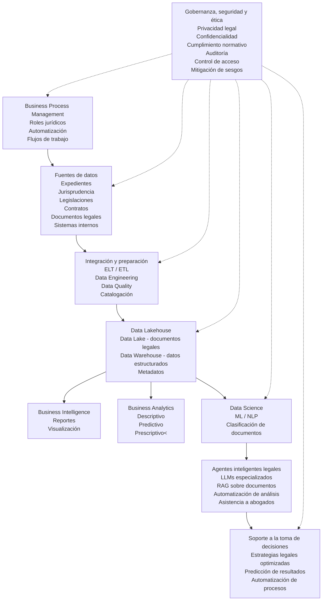

#### Caso 2 ...
# Nombre de la empresa: Frodalex Systems

## Enfoque organizacional
La propuesta de sistema para el despacho es implementar una estrategia integral de gestión y explotación avanzada de datos legales, con el objetivo de optimizar los procesos y la gestión interna, mejorar la toma de decisiones estratégicas y aumentar la eficiencia operativa.
- Administración de expedientes
- Seguimiento de casos
- Gestión de audiencias
- Control documental legal

## Fuentes de datos  

